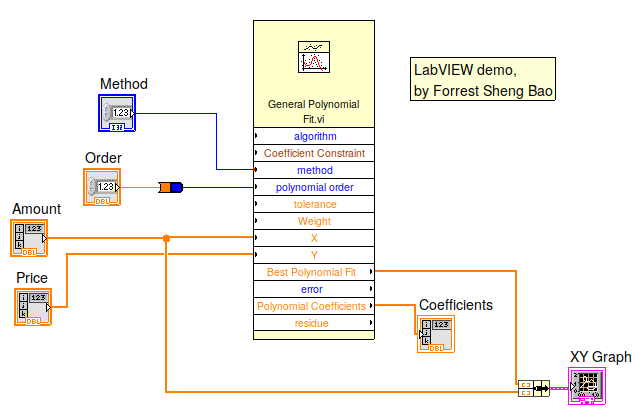
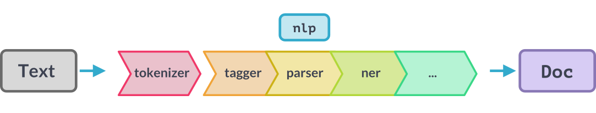

# Agenda
1. The company: National  Instruments (NI, NASDAQ:NATI)
2. The products: virtual instruments and LabVIEW
3. Something technical about programming languages: graphical programming is the future for Gen Z. 


# Why I picked NI for Episode 1
- I am building something about graphical programming
- NI is by engineers and scientists and for engineers and scientists -- "Be the user of your product" 

# My experience with NI
I programmed LEGO MindStorm Robot in LabVIEW when I was in high school

# The company: National Instruments (NI)

{width=30%}

- Founded in 1976 in UT Austin
- by two gradudate students ([Jeff Kodosky](https://www.ni.com/en-us/about-ni/leadership/kodosky.html) and [Bill Nowlin](https://www.legacy.com/us/obituaries/statesman/name/william-nowlin-obituary?id=9229573)) and their supervisor, [Dr. James Truchard](https://en.wikipedia.org/wiki/James_Truchard).
- Went public in 1995 (NASDAQ:NATI)
- By 2019, over 7,000 employees worldwide, with offices in 45 countries, and a market capitalization of $5 billion. 
- Pioneer of virtual instruments and LabVIEW
- James Truchard is a member of (US) National Academy of Engineering and Royal Swedish Academy of Engineering Sciences. 

# The founding of NI
- In 1976, at UT Austin, the three co-founders were working on a project for the US Navy to collect data from underwater acoustic instruments and to analyze the data on computers. 
- Realizing there were no good solutions to interface the instruments and the computers back then, they started NI in April 1976 in Truchard's garage. 
- They borrowed $10,000 from a bank and bought a PDP-11 computer. 
- First product was finished in April 1977. 
- They made a cold call to Kelly Air Force Base in San Antonio, TX and sold their first unit. 

# All in and risks
- NI reached a crisis point in July 1978. 
- Intead of quitting, the co-founders bet on their dreams by pouring more money in. 
- They mailed a flyer to 15,000 engineers and scientists and shipped $78,000 in products that year. 

# Something technical: virtual instrumentation, the beauty

- Conventional instruments: users can do measurements but can barely use that instruments to develop derived products. 

- Virtual Instruments (VIs): Measurements are sent to a computer/FPGA for customizable tasks. It's limitless! 

```{.mermaid width=3000}
graph  LR;
  A(Temperature sensor)
  B(Read temperature)
  C(Alarm if temperature<br> is above 10C)
  D(Read temperature <br> 10 times)
  E(If the average is  above 10C, send me an email)
  F(Do FFT to get <br> temperature rhythm)
  G(Object Detection using <br> thermal signatures in ML)
  A-->B 
  B-->C
  B-->D-->E
  D-->F-->G
```

- [James Truchard was elected to a member of NAE for the creation of VI](https://www.nae.edu/31001/Dr-James-J-Truchard)

# NI's hardware
https://www.ni.com/en-us/shop.html 


# LabVIEW: Programming virtual instruments

{width=70%}

- A graphical (vs. text-based) programming environment
- Flowchart-based
- Mainly used for instrumentation, control and automation
- One of the two commerically successful graphical programming languages (the other: Mathworks' Simulink)
- Invented by NI in 1986, led by Jeff Kodosky

# Graphical representation of function calls
{width=70%}

# Graphical/flowchart programming as a programming paradigm 
- Not good for general-purpose programming
- But good for domain-specific (instrumentation or data science) programming 
- Flowchart programming is the future for Gen Z (they grow up with short videos and mobile devices). 

# Text-based coding intimidates people
- Three things I learned after years of teaching programming at college:
    1. People have a very short attention span
    2. People hate abstraction
    3. People hate formal things/syntax 
- I have seen enough students struggling with `return`, local variables, and type errors. 
- People are intimidated when seeing code. 
- Programmers $\subset$ people
- Command line vs GUI : text-based coding vs. graphical programming

# Graphical/flowchart programming is for human brains


- Our brain prefers graphs than text. 
- We drew before we wrote. Babies read picture books first.
- "A picture is worth a thousand words."
- Flowchart programming solves the three reasons that text-based coding intimidates people

| Problems/Reasons | Solution |
|---|---|
| People have a very short attention span |  A shallow learning curve (flowcharts are in all walks of life) |
| People hate abstraction| Visualizing abstractions (e.g., function calls) | 
| People hate formal syntax | Visual guidance  | 


# Graphical/flowchart programming is for Gen Z
- Gen Z grow up with mobile devices and short videos. 
- They have a very short attention span and they prefer non-abstractive presentation of information (vs. conventional book reading)
- Many of them face challenges to read documentations (to learn a language or API) nor code. 

# Graphical/flowchart programming is for domain-specific tasks

{width=50%}
{width=55%}

- It does not suit for general-purpose programming or when while-loops are heavily used. 
- It suits step-by-step processing of data, such as 
  - Data analytics, including NLP
  - Instrumentation, control, and automation 

# Lessons to learn from LabVIEW 
- Strong type (it also has good things)
- No overloading nor broadcasting (too many functions)
- Poor function search and lack of autocompletion/prompt
- Poor support to strings (e.g., integer for method names)
- Everything is a GUI widget  
- Lack of easy ways to copy programs (vs. `mermaid` flowchart language)
- Icons and icon design 

# Thank you

All comments are welcome. 

My handler on all platforms (YouTube, Twitter, Gmail, Telegram, etc.): ForrestBao 

Subscribe, like, and share: \url{https://www.youtube.com/c/ForrestBao/}

You can see my real face when we have  1,000 subscribers and 4,000 valid public watch hours! 


 


